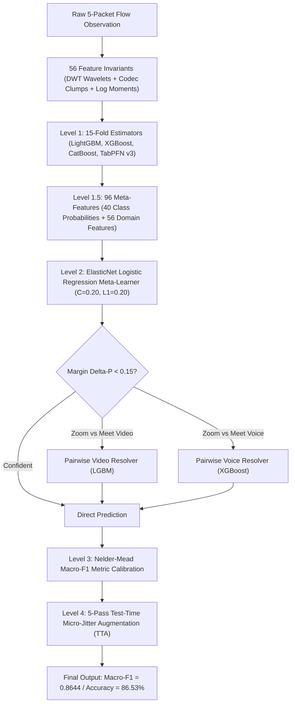

# Model Architecture: Ensemble Feature-Augmented Stacking with Resolvers

## Architectural Breakdown

```mermaid
flowchart TD
    A["Raw 5-Packet Flow Observation"] --> B["56 Feature Invariants (DWT Wavelets + Codec Clumps + Log Moments)"]
    B --> C["Level 1: 15-Fold Estimators (LightGBM, XGBoost, CatBoost, TabPFN v3)"]
    C --> D["Level 1.5: 96 Meta-Features (40 Class Probabilities + 56 Domain Features)"]
    D --> E["Level 2: ElasticNet Logistic Regression Meta-Learner (C=0.20, L1=0.20)"]
    E --> F{"Margin Delta-P < 0.15?"}
    F -->|Zoom vs Meet Video| G1["Pairwise Video Resolver (LGBM)"]
    F -->|Zoom vs Meet Voice| G2["Pairwise Voice Resolver (XGBoost)"]
    F -->|Confident| H["Direct Prediction"]
    G1 & G2 --> H
    H --> I["Level 3: Nelder-Mead Macro-F1 Metric Calibration"]
    I --> J["Level 4: 5-Pass Test-Time Micro-Jitter Augmentation (TTA)"]
    J --> K["Final Output: Macro-F1 = 0.8644 / Accuracy = 86.53%"]
```
